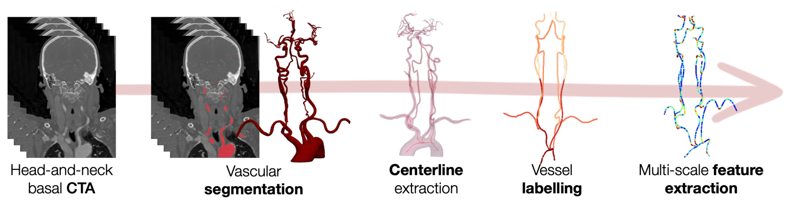

# Arterial

**An AI framework for automated vascular analysis and endovascular intervention planning**

[](https://www.python.org/downloads/)
[](LICENSE)

---

## Overview

Arterial is a comprehensive AI framework for fully automated vascular tortuosity analysis from CT Angiography (CTA) images. Originally developed to support mechanical thrombectomy (MT) planning for acute ischemic stroke (AIS), Arterial provides:

- **Automated vessel segmentation** using deep learning (nnU-Net v2)
- **Centerline extraction** via VMTK
- **Anatomical landmark detection** using 3D U-Net
- **Vessel labelling** with Graph Neural Networks (GNN)
- **Multi-scale feature extraction** for vascular characterization
- **Catheter pathway mapping** and **accessibility prediction**

The framework processes a single CTA image and outputs a complete vascular analysis including segmentation masks, labeled centerlines, geometric features, and procedural predictions—all without manual input.

<p align="center">
  
</p>

<p align="center">
  <em>The Arterial pipeline, from a basal head-and-neck CTA through to multi-scale vascular features.</em>
</p>

---

## Key Features

| Feature | Description |
|---------|-------------|
| **Deep Learning Segmentation** | nnU-Net v2 models for extracranial and intracranial vessels |
| **Automatic Centerlines** | VMTK-based centerline extraction with branch splitting |
| **Landmark Detection** | Automatic identification of ICA and MCA bifurcations |
| **Vessel Labelling** | GNN-based classification of 14 vessel types |
| **Feature Extraction** | Local, segment, and global vascular features |
| **Pathway Mapping** | 8 catheter configurations (femoral/radial × left/right × anterior/posterior) |
| **End-to-End Pipeline** | Single command from CTA to complete analysis |

---

## Modules

Arterial is organized into specialized modules, each with detailed documentation:

| Module | Description | Documentation |
|--------|-------------|---------------|
| **Segmentation** | nnU-Net v2 vessel segmentation (extracranial/intracranial) | [README](arterial/segmentation/README.md) |
| **Centerline Extraction** | VMTK-based centerline computation and branching | [README](arterial/centerline_extraction/README.md) |
| **Landmark Detection** | Automatic anatomical landmark identification | [README](arterial/landmark_detection/README.md) |
| **Vessel Labelling** | GNN-based anatomical vessel classification | [README](arterial/vessel_labelling/README.md) |
| **Feature Extraction** | Multi-scale vascular feature computation | [README](arterial/feature_extraction/README.md) |
| **Access Prediction** | Catheter accessibility prediction with attention maps | [README](arterial/access_prediction/README.md) |
| **Run (Processor)** | Pipeline orchestration and CLI | [README](arterial/run/README.md) |

---

## Installation

### System Requirements

- **Operating System**: Linux (Ubuntu 22.04 tested), macOS (14.x, 15.x)
- **Python**: 3.11
- **GPU**: NVIDIA GPU with CUDA support (recommended for inference)

### Linux (Ubuntu)

```bash
# Create conda environment
conda create -n arterial_env python=3.11
conda activate arterial_env

# Install VMTK
conda install -c conda-forge vmtk

# Install PyTorch and dependencies
pip install torch==2.6.0 torch_geometric==2.6.1 monai torchio nnunetv2

# Install PyG dependencies (CUDA 12.4)
pip install pyg_lib torch_scatter==2.1.2 torch_sparse==0.6.18 \
    torch_cluster==1.6.3 torch_spline_conv==1.2.2 \
    -f https://data.pyg.org/whl/torch-2.6.0+cu124.html
```

### macOS

> **Not recommended for segmentation or landmark detection.** macOS has no CUDA, so those two stages
> run full 3D inference on CPU — on the order of ten minutes per case for segmentation alone. Run them
> on a Linux machine with an NVIDIA GPU. macOS is fine for development and for the remaining stages
> (centerline extraction, vessel labelling, feature extraction, access prediction).

```bash
# Create conda environment
conda create -n arterial_env python=3.11
conda activate arterial_env

# Install VMTK
conda install -c conda-forge vmtk

# Install PyTorch and dependencies
pip install --upgrade pip
pip install torch==2.2.2 torch_geometric
pip install torch_scatter torch_sparse torch_cluster torch_spline_conv \
    -f https://data.pyg.org/whl/torch-2.2.0+cpu.html
```

### Install Arterial

```bash
# Clone the repository
git clone https://github.com/FLOWCAT-CV/arterial.git
cd arterial

# Install as editable package
pip install -e .
```

### Environment Configuration

Arterial finds its package directory through the `arterial_dir` variable. From the repository root —
where the previous step left you — append it to your shell startup file. This writes the absolute
path, so run it once, from that directory:

```bash
# Linux
echo "export arterial_dir=\"$PWD/arterial\"" >> ~/.bashrc && source ~/.bashrc

# macOS
echo "export arterial_dir=\"$PWD/arterial\"" >> ~/.zshrc && source ~/.zshrc
```

Confirm it points at the inner package directory, not the repository root:

```bash
echo "$arterial_dir"      # should end in .../arterial/arterial
```

### Model Weights

The trained weights are **not** stored in this repository. They are archived on Zenodo, under a DOI,
and downloaded by a bundled script. No account, no token and no licence gate: the weights come down
as a single archive, verified against the published checksum.

> 📦 **[Zenodo record](https://zenodo.org/records/22694951)** — DOI `10.5281/zenodo.22694951`

Everything in the archive is an Arterial model under CC BY-NC 4.0 except
`segmentation/totalsegmentator_mandible/`, which is redistributed from
[TotalSegmentator](https://github.com/wasserth/TotalSegmentator) under Apache-2.0 and carries its own
`LICENSE` and `NOTICE` — see [THIRD_PARTY_NOTICES.md](THIRD_PARTY_NOTICES.md).

#### Download

```bash
bash download_models.sh
```

The script defaults to record `22694951`; pass `--record <id>` for another version. That downloads about 1.1 GB into `$arterial_dir/models`, checks its SHA256 against the published
one, extracts it, and verifies that every expected checkpoint — and the two Apache-2.0 files —
arrived.

It then writes the models location into your shell startup file — `~/.zshrc` for zsh,
`~/.bash_profile` or `~/.bashrc` for bash — so it survives new terminals:

```bash
# >>> arterial models >>>
export ARTERIAL_MODELS_DIR="/path/to/arterial/arterial/models"
# <<< arterial models <<<
```

The block is marked, so running the script again updates it in place rather than appending a second
copy, and nothing else in the file is touched. Pass `--no-persist` to skip this and set the variable
yourself. Run `source ~/.zshrc`, or open a new terminal, for it to take effect.

Because it is a single archive there is no per-file caching: re-running re-downloads everything.

#### Installing the weights somewhere else

By default the weights land in `$arterial_dir/models`, which is gitignored. To keep them elsewhere —
a shared drive, a larger volume, a location several checkouts can share — set `ARTERIAL_MODELS_DIR`
before running the script, and keep it set so Arterial can find them afterwards:

```bash
export ARTERIAL_MODELS_DIR="/data/arterial-models"   # add to ~/.bashrc or ~/.zshrc
bash download_models.sh --record 22694951
```

`ARTERIAL_MODELS_DIR` always takes precedence over the default location.

#### Offline and air-gapped machines

Clinical environments frequently have no outbound network access. Download on a connected machine,
copy the directory across, and point `ARTERIAL_MODELS_DIR` at it:

```bash
# on a connected machine
curl -L -o arterial-models-v1.tar.gz \
  "https://zenodo.org/records/22694951/files/arterial-models-v1.tar.gz?download=1"

# on the target machine
mkdir -p /data/arterial-models
tar xzf arterial-models-v1.tar.gz -C /data/arterial-models
export ARTERIAL_MODELS_DIR=/data/arterial-models
```

#### Layout

```
<models directory>/
├── access_prediction/     dataset.json, fold_{0..4}/model_weights.pth
├── landmark_detection/    six_landmarks_2ch.pth, six_landmarks_11_7.pth
├── segmentation/          extracranial_vessels/, intracranial_vessels/,
│                          totalsegmentator_mandible/  (+ LICENSE, NOTICE — Apache-2.0)
└── vessel_labelling/      extracranial_vessels/
```

All of these are Arterial models under CC BY-NC 4.0 except `segmentation/totalsegmentator_mandible/`,
which is redistributed from [TotalSegmentator](https://github.com/wasserth/TotalSegmentator) under
Apache-2.0 and carries its own `LICENSE` and `NOTICE`. Keep those two files with the weights if you
copy them anywhere — see [THIRD_PARTY_NOTICES.md](THIRD_PARTY_NOTICES.md).

---

## Quick Start

### Command-Line Usage

```bash
# Full analysis pipeline (extracranial vessels)
python perform_analysis.py -cd /path/to/case_dir

# With explicit CTA path
python perform_analysis.py -cd /path/to/case_dir -cnp /path/to/cta.nii.gz

# Intracranial vessel analysis
python perform_analysis.py -cd /path/to/case_dir -m intracranial_vessels

# Fast segmentation mode
python perform_analysis.py -cd /path/to/case_dir -fast

# Skip segmentation (if already computed)
python perform_analysis.py -cd /path/to/case_dir -ss
```

### Python API

```python
from arterial.segmentation.segmenter import VesselSegmenter
from arterial.centerline_extraction.centerline_extractor import CenterlineExtractor
from arterial.vessel_labelling.vessel_labeller import VesselLabeller
from arterial.feature_extraction.feature_extractor import FeatureExtractor

case_dir = "/path/to/case"
cta_nifti_path = "/path/to/cta.nii.gz"

# Step 1: Segment vessels
segmenter = VesselSegmenter(case_dir, mode="extracranial_vessels", cta_nifti_path=cta_nifti_path)
segmenter.segment_vessels_from_cta()

# Step 2: Extract centerlines
extractor = CenterlineExtractor(case_dir, mode="extracranial_vessels")
extractor.perform_centerline_extraction()
extractor.perform_branch_model_extraction()
extractor.perform_centerline_postprocessing()

# Step 3: Label vessels
labeller = VesselLabeller(case_dir, mode="extracranial_vessels")
labeller.build_segments_graph()
labeller.predict_vessel_types()

# Step 4: Extract features
feature_ext = FeatureExtractor(case_dir, mode="extracranial_vessels")
feature_ext.build_local_graph()
feature_ext.extract_local_features()
feature_ext.extract_segment_features()
feature_ext.extract_global_features()
feature_ext.extract_supersegments()
```

### Using the Processor

```python
from argparse import Namespace
from arterial.run.processor import ArterialProcessor

args = Namespace(
    case_dir="/path/to/case",
    cta_nifti_path=None,
    mode="extracranial_vessels",
    sampling_distance_mm=2,
    fast_segmentation=False,
    skip_segmentation=False,
    skip_centerline_extraction=False,
    skip_branching=False,
    skip_clipping=False,
    skip_vessel_labelling=False,
    skip_feature_extraction=False,
    skip_access_prediction=False,
    skip_landmark_detection=False,
    cl_dice_nnunet=False,
    no_slicing=False,
    set_threshold_099=False
)

processor = ArterialProcessor(args)
timing = processor.perform_analysis()

print(f"Total analysis time: {timing['total_time']:.2f}s")
```

---

## Expected Input

| Requirement | Format | Description |
|-------------|--------|-------------|
| CTA Image | NIfTI (`.nii.gz`) | CT Angiography volume |
| Case Directory | Folder | Working directory for outputs |

**Default naming convention**: `case_dir/cta.nii.gz`

---

## Expected Outputs

After running the full pipeline:

```
case_dir/
├── cta.nii.gz                              # Input
└── extracranial_vessels/
    ├── segmentation.nii.gz                  # Vessel mask
    ├── centerlines/                         # Individual centerline models
    ├── branch_model.vtk                     # Merged branch model
    ├── centerline_segments_array.npy        # Centerline data
    ├── landmarks.json                       # Detected landmarks (RAS mm)
    ├── landmarks_slicer.json                # Same, as 3D Slicer markups
    ├── segments_graph_pred.pickle           # Labeled vessel graph
    ├── local_graph.pickle                   # Featurized graph
    ├── supersegments/                       # Catheter pathways (8 configs)
    └── access_prediction/                   # Accessibility predictions
```

---

## Analysis Modes

| Mode | Vessels | Landmarks | Features |
|------|---------|-----------|----------|
| `extracranial_vessels` | Aortic arch through Circle of Willis | 6 (bilateral ICA, EICA, MCA) | Full pipeline |
| `intracranial_vessels` | Circle of Willis and branches | 4 (bilateral TICA, MCA) | Individual centerlines |

---

## Command-Line Options

| Flag | Description |
|------|-------------|
| `-cd`, `--case_dir` | Path to case directory (required) |
| `-cnp`, `--cta_nifti_path` | Path to CTA NIfTI file |
| `-m`, `--mode` | Analysis mode (`extracranial_vessels` or `intracranial_vessels`) |
| `-sd`, `--sampling_distance_mm` | Centerline sampling distance (default: 2) |
| `-fast`, `--fast_segmentation` | Use fast (single-resolution) segmentation |
| `-ss`, `--skip_segmentation` | Skip segmentation step |
| `-sce`, `--skip_centerline_extraction` | Skip centerline extraction |
| `-sb`, `--skip_branching` | Skip branch model extraction |
| `-svl`, `--skip_vessel_labelling` | Skip vessel labelling |
| `-sfe`, `--skip_feature_extraction` | Skip feature extraction |
| `-sap`, `--skip_access_prediction` | Skip access prediction |
| `-sld`, `--skip_landmark_detection` | Skip landmark detection |
| `-sc`, `--skip_clipping` | No effect; accepted for backwards compatibility |
| `-clnn`, `--cl_dice_nnunet` | Use the nnU-Net trained with centerline Dice instead of the vanilla one |
| `-ns`, `--no_slicing` | Segment the whole volume without the head/neck split (intracranial mode) |
| `-s99`, `--set_threshold_099` | Binarise the segmentation at probability 0.99 |

---

## Citation

If you use Arterial in your research, please cite:

```bibtex
@article{canals2023vascular,
  title={A fully automatic method for vascular tortuosity feature extraction in the supra-aortic region: Unraveling possibilities in stroke treatment planning},
  author={P. Canals, S. Balocco, O. Díaz, J. Li, A. García-Tornel, A. Tomasello, M. Olivé-Gadea, M. Ribo},
  journal={Computerized Medical Imaging and Graphics},
  volume={104},
  pages={102170},
  year={2023},
  publisher={Elsevier},
  doi={10.1016/j.compmedimag.2022.102170}
}
```

> 🔗 [https://www.sciencedirect.com/science/article/pii/S0895611122001409](https://www.sciencedirect.com/science/article/pii/S0895611122001409)

### Third-party models

Arterial's default pipeline runs the `craniofacial_structures` model from TotalSegmentator to split
a head-and-neck CTA. Its authors ask that you cite the following alongside your own work:

```bibtex
@article{wasserthal2023totalsegmentator,
  title={TotalSegmentator: Robust Segmentation of 104 Anatomic Structures in CT Images},
  author={Wasserthal, Jakob and Breit, Hanns-Christian and Meyer, Manfred T. and Pradella, Maurice and Hinck, Daniel and Sauter, Alexander W. and Heye, Tobias and Boll, Daniel and Cyriac, Joshy and Yang, Shan and Bach, Michael and Segeroth, Martin},
  journal={Radiology: Artificial Intelligence},
  volume={5},
  number={5},
  year={2023},
  doi={10.1148/ryai.230024}
}

@article{beyer2026craniofacial,
  title={An innovative AI-based dual segmentation application for head surgery},
  author={Beyer, M. and Brasse, A. and Abazi, S. and Beyer, M. and Vinayahalingam, S. and Seifert, L. and Wasserthal, J. and Segeroth, M. and Sharma, N. and Thieringer, F. M.},
  journal={International Journal of Oral and Maxillofacial Surgery},
  year={2026},
  doi={10.1016/j.ijom.2025.11.005}
}

@article{isensee2021nnunet,
  title={nnU-Net: a self-configuring method for deep learning-based biomedical image segmentation},
  author={Isensee, Fabian and Jaeger, Paul F. and Kohl, Simon A. A. and Petersen, Jens and Maier-Hein, Klaus H.},
  journal={Nature Methods},
  volume={18},
  number={2},
  pages={203--211},
  year={2021},
  doi={10.1038/s41592-020-01008-z}
}
```

---

## Relevant Work Enabled by Arterial

The following publications have utilized the Arterial framework for vascular analysis in stroke research:

### Vascular Tortuosity Impact on Endovascular Treatment Outcomes in Patients with Distal Vessel Occlusion 

Analysis of extracranial vascular tortuosity characteristics and their association with mechanical thrombectomy procedural outcomes.

> Pere Canals, Alvaro García-Tornel, Giulio Maria Fiore, Marc Rodrigo-Gisbert, Blanca Sastre, Jordi Mayol, Jesús David González Riveros, and Marc Ribo. **Prognostic value of intracranial vascular tortuosity in thrombectomy for distal vessel occlusion.** *European Stroke Journal* 2025.
> 
> 🔗 [https://journals.sagepub.com/doi/full/10.1177/23969873251350124](https://journals.sagepub.com/doi/full/10.1177/23969873251350124)

### AI-derived carotid elongation ratio analysis for estimating procedural delay and clinical utility in mechanical thrombectomy.

Analysis of AI-derived carotid elongation ratio and its association with procedural delay in mechanical thrombectomy.

> Julien Ognard, Pere Canals, Jiahui Li, et al. **AI-derived Carotid Elongation Ratio may predict procedural delay but offer limited prognostic utility in mechanical thrombectomy.** *American Journal of Neuroradiology* 2026.
> 
> 🔗 [https://www.ajnr.org/content/early/2026/02/25/ajnr.A9262](https://www.ajnr.org/content/early/2026/02/25/ajnr.A9262)


### Deep learning-based model for difficult transfemoral access prediction compared with human assessment in stroke thrombectomy

Analysis of a model for difficult transfemoral access prediction derived from deep learning-based features compared with human expert assessment for identifying difficult transfemoral access in stroke thrombectomy procedures.

> Pere Canals, Alvaro Garcia-Tornel, Manuel Requena, Magda Jabłońska, Jiahui Li, Simone Balocco, Oliver Díaz, Alejandro Tomasello, Marc Ribo. **Deep learning-based model for difficult transfemoral access prediction compared with human assessment in stroke thrombectomy.** *Journal of NeuroInterventional Surgery* 2024;17:653-659.
> 
> 🔗 [https://jnis.bmj.com/content/17/6/653](https://jnis.bmj.com/content/17/6/653)

### ArterialGNet: Graph Neural Network for Access Prediction

A multi-scale graph neural network (ArterialGNet) designed to predict impossible femoral access in stroke mechanical thrombectomy using vascular centerline graph embeddings. Achieved AUROC of 0.89 on a dataset of 493 interventions.

> Canals P, García-Tornel A, Ribo M. **ArterialGNet: Impossible Femoral Access Prediction in Stroke Mechanical Thrombectomy with Vascular Centerline Graph Embeddings.** In: *Image Analysis in Stroke Diagnosis and Interventions (ISLES/SWITCH 2024)*. Lecture Notes in Computer Science, vol 15408. Springer, 2025.
> 
> 🔗 [https://link.springer.com/chapter/10.1007/978-3-031-81101-2_8](https://link.springer.com/chapter/10.1007/978-3-031-81101-2_8)

---

## License

Copyright 2022-2026 Vall d'Hebron Research Institute (VHIR) and Universitat de Barcelona (UB), Barcelona, Spain.
Intellectual property is jointly held by VHIR and UB.

**Source code** — this repository — is licensed under the
[PolyForm Noncommercial License 1.0.0](https://polyformproject.org/licenses/noncommercial/1.0.0).
See [LICENSE](LICENSE) for the full terms. Any noncommercial purpose is permitted, and use by
educational institutions, public research organisations, and public health or safety organisations is
permitted regardless of funding source. Commercial use requires a separate licence — contact the authors.

**Trained model weights** — distributed separately via Zenodo, not in this repository — are licensed
under [CC BY-NC 4.0](https://creativecommons.org/licenses/by-nc/4.0/): noncommercial use only, with
attribution. **One exception:** `<models directory>/segmentation/totalsegmentator_mandible/` is
redistributed from [TotalSegmentator](https://github.com/wasserth/TotalSegmentator) under the
[Apache License 2.0](licenses/Apache-2.0.txt), copyright the TotalSegmentator authors. Apache-2.0, not
CC BY-NC 4.0, governs that model — including commercial use of it — and its licence text and
attribution notice ship inside that directory as `LICENSE` and `NOTICE`. See
[THIRD_PARTY_NOTICES.md](THIRD_PARTY_NOTICES.md) for the full statement.

Arterial's dependencies carry their own licences (nnU-Net and MONAI under Apache-2.0, VMTK under BSD,
PyTorch Geometric under MIT), which you must comply with independently.

---

## Acknowledgments

Arterial was developed at the Stroke Research group at Vall d'Hebron Research Institute (VHIR), Barcelona, Spain.

**Key dependencies:**
- [nnU-Net](https://github.com/MIC-DKFZ/nnUNet) - Deep learning segmentation
- [VMTK](https://github.com/vmtk/vmtk) - Vascular Modeling Toolkit
- [PyTorch Geometric](https://pytorch-geometric.readthedocs.io/) - Graph Neural Networks
- [MONAI](https://github.com/Project-MONAI/MONAI) - Medical image analysis

**Third-party model:** head/neck splitting uses the `craniofacial_structures` model from [TotalSegmentator](https://github.com/wasserth/TotalSegmentator), redistributed unmodified under Apache-2.0 with thanks to its authors. See [THIRD_PARTY_NOTICES.md](THIRD_PARTY_NOTICES.md).

---

## Contributing

Contributions are welcome! Please feel free to submit a Pull Request.

---

## Contact

For questions and support, please open an issue on GitHub.
